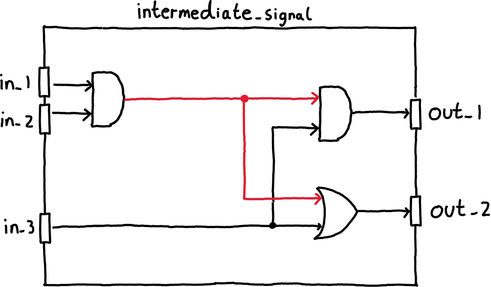
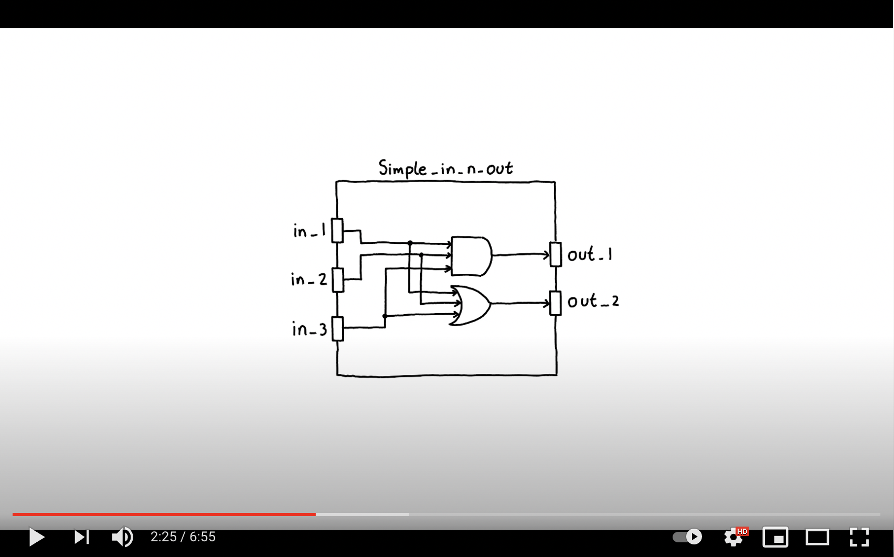
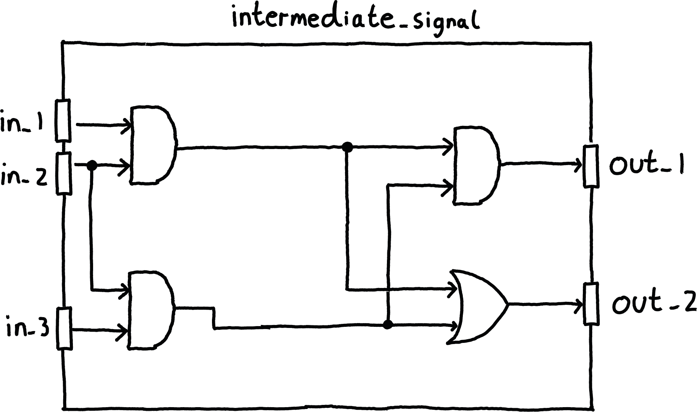

  

## Learning outcomes
* Introduction to Verilog signals.

## Video

	

## Exercise

  

Consider the adaption to our circuit above. Using an extra internal signal adapt the HDL code in ``intermediate_signal.sv`` to match the diagram of the circuit. 

