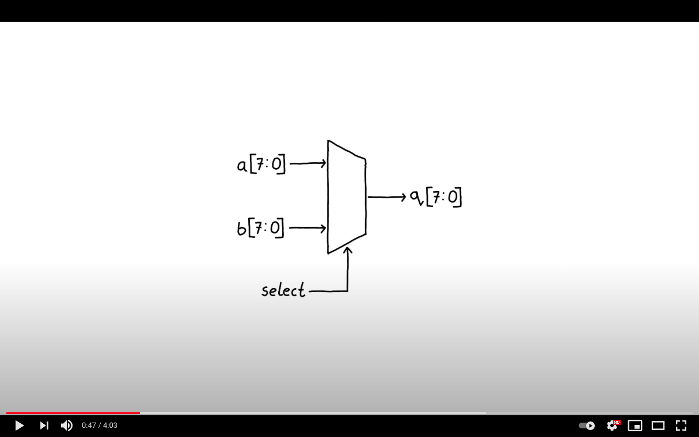

  

## Learning outcomes
* Introduction to multi-bit bus signals.
* Introduction to the concept of a multiplexer.
* Introduction to a combinatorial conditional assignment.

## Video

	

## Exercise

* Make the same mux as this circuit but out of logic gates instead of the conditional assignment. 

