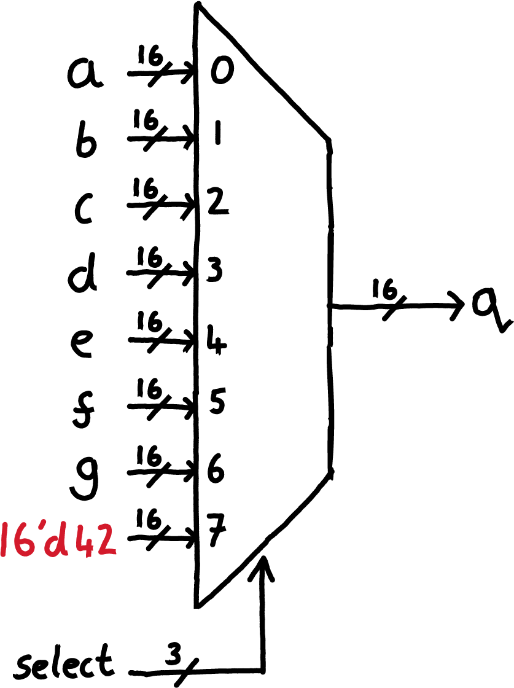
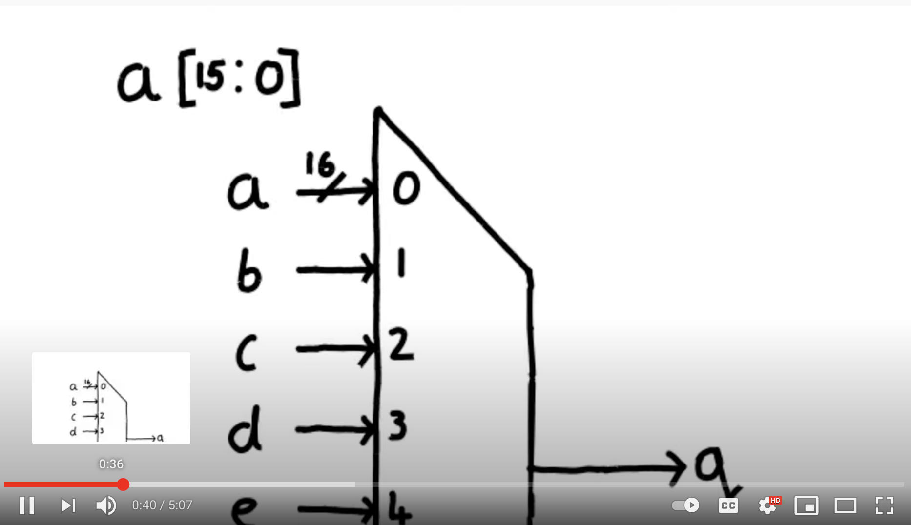
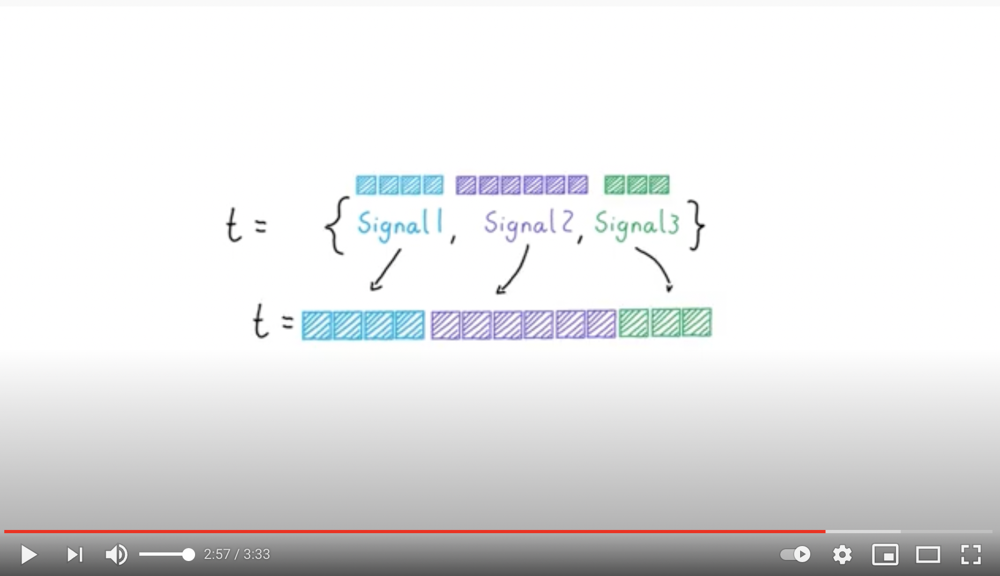
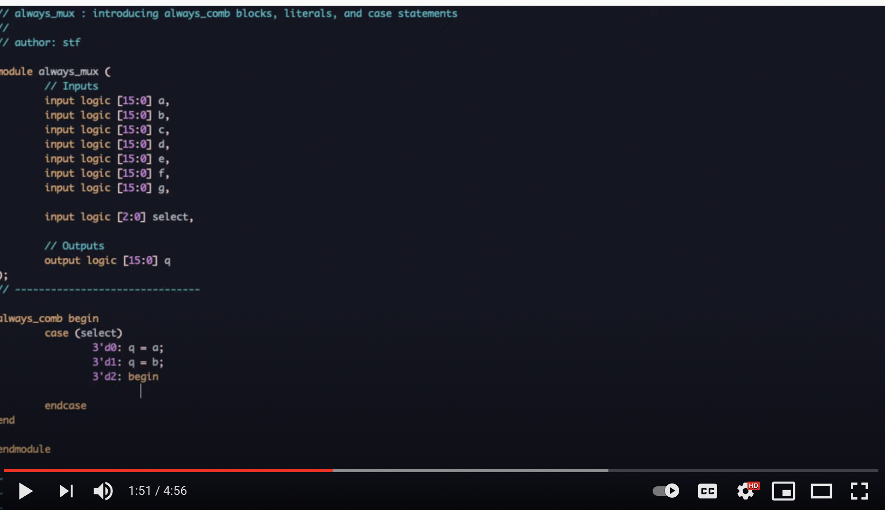
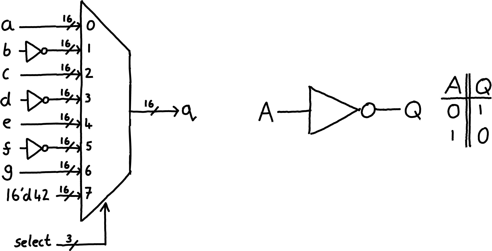

  

## Learning outcomes
* Introduce combinatorial procedural blocks ``always_comb``. (video 1)
* Explain how to define a literal value in system verilog. (video 2)
* Explain how to use if statements and case statements in a procedural block. (video 3)

## Video 1

	

## Video 1: exercise

* Using an ``always_comb`` block make the output ``q`` be the bitwise OR of inputs ``a``, ``b``, ``c``, and ``d``.   

## Video 2

	

## Video 2: exercise

* Assign the output ``q`` to be ``42`` using a binary literal.

## Video 3

	

## Video 3: exercise

  

* Using a bitwise NOT operation -- create a MUX where all the odd signals are selected an inverted version of the corresponding input is sent to the output, apart from input ``7`` which is always ``42``. See the diagram above.

