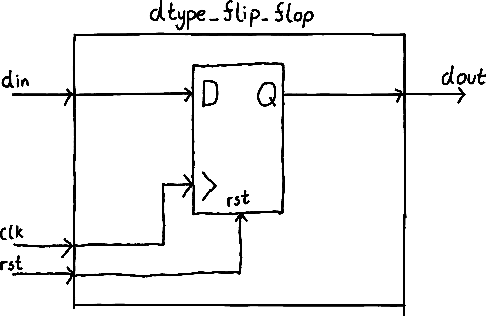
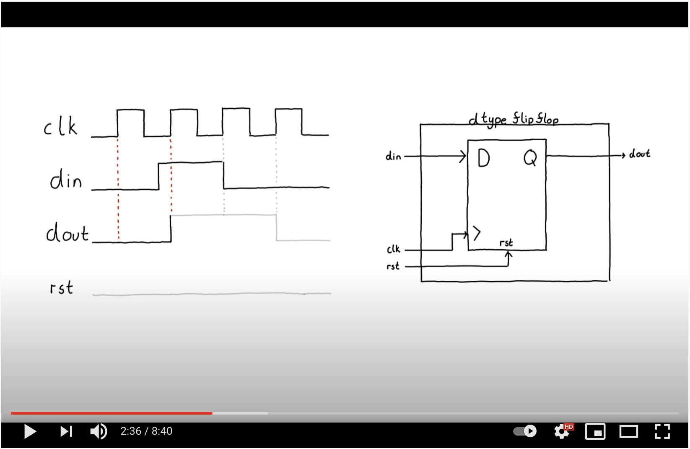

  

## Learning outcomes
* How to write a basic sequential circuit.
* How to use ``always_ff @(posedge clk) begin``.
* The importance of a reset signal.
* What a D-Type Flip Flop/Register is.

## Video 

	

## Exercise

